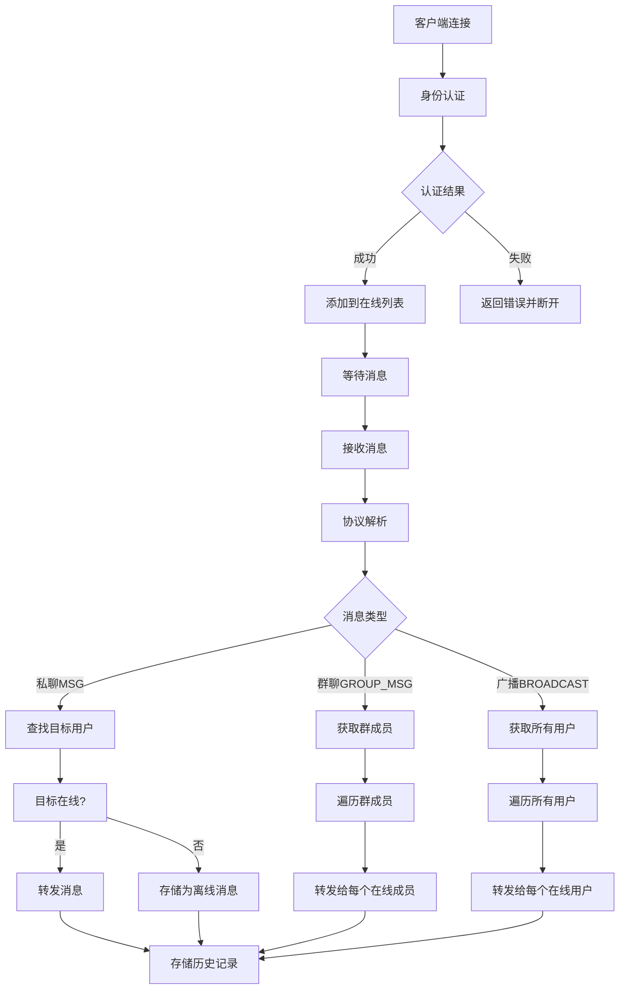

# 消息转发服务器Demo项目 - **已实现部分详解**

以下是目前**已完成设计和准备就绪**的部分，可以直接开始编码实现：

## 🏗️ **已完成的基础架构**

### 1. **工程目录结构** ✅
已设计完成的模块化工程结构：
```
message_forward_server_demo/
├── models/           # 数据模型（已设计完成）
├── core/             # 业务核心（接口已定义）
├── protocol/         # 协议处理（格式已定义）
├── storage/          # 数据存储（方案已确定）
├── network/          # 网络层（方案已确定）
└── utils/            # 工具模块（接口已定义）
```

### 2. **数据模型 (models/)** ✅
**文件**：`models.h`（**已编写完成**）
- **数据结构**：定义了`User`、`Client`、`Message`、`Group`、`Session`等核心结构
- **常量定义**：消息类型、状态码、长度限制等
- **接口清晰**：每个字段都有详细注释，可直接用于编码

### 3. **核心模块接口** ✅
每个模块的职责和接口已明确定义：

| 模块 | 职责 | 状态 |
|------|------|------|
| **connection_manager** | 客户端连接管理（增删查） | 接口已定义 |
| **message_router** | 消息路由（一对一/群组/广播） | 逻辑流程已设计 |
| **session_manager** | 用户认证和会话管理 | 流程已设计 |
| **protocol/parser** | 消息解析（字符串→结构体） | 协议格式已定义 |
| **storage/history** | 消息历史存储 | 存储格式已确定 |

### 4. **协议设计** ✅
**应用层协议格式**：`消息类型|发送者|接收者|时间戳|内容`
```
示例：
LOGIN|alice|123456               # 登录
MSG|alice|bob|时间戳|你好        # 私聊
BROADCAST|alice|*|时间戳|大家好  # 广播
GROUP_MSG|alice|群组名|时间戳|内容 # 群聊
HISTORY_PRIVATE|alice|bob|10     # 查询历史
```

### 5. **存储方案** ✅
**数据文件格式**：
```plaintext
# users.dat
用户名|密码|用户ID|注册时间戳|激活状态

# messages.dat  
消息ID|类型|发送者|接收者|时间戳|内容|状态

# groups.dat
群组ID|群组名|创建者|创建时间|成员列表
```

### 6. **网络通信基础** ✅
- **传输协议**：TCP（已确定）
- **并发模型**：select/poll（已选择）
- **端口**：6666（已指定）
- **认证方式**：用户名+密码（已设计）

## 🔄 **已设计完成的工作流程**

### 消息转发流程（逻辑已设计完成）


### 用户认证流程（逻辑已设计完成）
```
1. 客户端连接 -> 发送LOGIN|用户名|密码
2. 服务器验证 -> 检查users.dat文件
3. 验证结果 -> AUTH_OK/AUTH_FAIL
4. 认证成功 -> 添加到在线列表，更新状态
```


**总结**：基础架构、数据模型、协议设计、模块划分等**设计工作已全部完成**，可以立即开始编码实现。建议按以下顺序开发：
1. 网络层（TCP服务器 + 事件循环）
2. 连接管理
3. 协议解析
4. 消息路由
5. 数据存储

