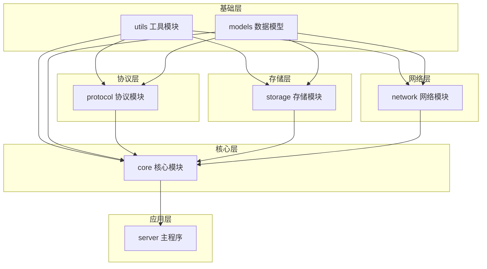

# ITit项目模块状态与依赖关系图

## 项目整体结构

```
ITit/
├── README.md
├── server.c           # 主程序
├── server.h
├── test_utils.c
├── core/              # 核心模块
│   ├── connection_manager.c  [✓ 已完成]
│   ├── session_manager.c      [✓ 已完成]
│   ├── message_router.c       [✗ 待开发]
│   └── core.h
├── models/            # 数据模型
│   ├── models.h             [✓ 已完成]
│   ├── client.h             [✗ 待开发]
│   ├── message.h            [✗ 待开发]
│   └── user.h               [✗ 待开发]
├── network/           # 网络模块
│   ├── tcp_server.c         [✓ 已完成]
│   ├── event_loop.c         [✓ 已完成]
│   ├── client_handler.c     [✓ 已完成]
│   ├── event_handler.c      [✗ 待开发]
│   └── network.h
├── protocol/          # 协议模块
│   ├── parser.c             [✓ 已完成]
│   ├── builder.c            [✓ 已完成]
│   ├── command_dandler.c    [✗ 待开发]
│   └── protocol.h
├── storage/           # 存储模块
│   ├── user_store.c         [✓ 已完成]
│   ├── history_manager.c    [✗ 待开发]
│   └── storage.h
├── tests/             # 测试模块
│   ├── test_utils.c         [✓ 已完成]
│   ├── test_protocol.c      [✓ 已完成]
│   ├── test_builder.c       [✓ 已完成]
│   ├── test_connection.c    [✓ 已完成]
│   ├── test_session.c       [✓ 已完成]
│   ├── resr_core.c
│   ├── test_core.c
│   └── test_core_simple.c
└── utils/             # 工具模块
    ├── logger.c             [✓ 已完成]
    ├── safe_utils.c         [✓ 已完成]
    ├── time_utils.c         [✓ 已完成]
    └── utils.h
```

## 模块依赖关系图



## 模块完成状态

| 模块 | 子模块 | 状态 | 说明 |
|------|--------|------|------|
| utils | logger.c | ✅ 完成 | 日志系统 |
|      | safe_utils.c | ✅ 完成 | 安全工具函数 |
|      | time_utils.c | ✅ 完成 | 时间工具函数 |
| models | models.h | ✅ 完成 | 通用模型定义 |
|      | client.h | ❌ 待开发 | 客户端数据结构 |
|      | message.h | ❌ 待开发 | 消息数据结构 |
|      | user.h | ❌ 待开发 | 用户数据结构 |
| protocol | parser.c | ✅ 完成 | 协议解析器 |
|         | builder.c | ✅ 完成 | 协议构建器 |
|         | command_dandler.c | ❌ 待开发 | 命令处理器 |
| storage | user_store.c | ✅ 完成 | 用户存储 |
|        | history_manager.c | ❌ 待开发 | 历史记录管理 |
| network | tcp_server.c | ✅ 完成 | TCP服务器 |
|        | event_loop.c | ✅ 完成 | 事件循环 |
|        | client_handler.c | ✅ 完成 | 客户端处理 |
|        | event_handler.c | ❌ 待开发 | 事件处理 |
| core | connection_manager.c | ✅ 完成 | 连接管理 |
|     | session_manager.c | ✅ 完成 | 会话管理 |
|     | message_router.c | ❌ 待开发 | 消息路由 |

## 开发优先级建议

1. **第一优先级**：models模块
   - user.h
   - message.h
   - client.h

2. **第二优先级**：核心功能
   - message_router.c

3. **第三优先级**：存储功能
   - history_manager.c

4. **第四优先级**：协议功能
   - command_dandler.c

5. **第五优先级**：网络功能
   - event_handler.c

## 测试覆盖情况

| 模块 | 测试文件 | 状态 |
|------|----------|------|
| utils | test_utils.c | ✅ 已完成并通过 |
| protocol | test_protocol.c | ✅ 已完成并通过 |
| protocol | test_builder.c | ✅ 已完成并通过 |
| core | test_connection.c | ✅ 已完成并通过 |
| core | test_session.c | ✅ 已完成并通过 |
| 未覆盖 | message_router.c | ❌ 无测试 |
| 未覆盖 | history_manager.c | ❌ 无测试 |
| 未覆盖 | command_dandler.c | ❌ 无测试 |
| 未覆盖 | event_handler.c | ❌ 无测试 |

## 总结

ITit项目已完成基础功能实现，包括工具模块、协议解析与构建、连接管理和会话管理等核心功能。待开发模块主要集中在数据模型定义、消息路由、历史记录管理、命令处理和事件处理等方面。建议优先完成models模块，为其他模块提供数据结构基础，然后逐步实现其他功能模块。
